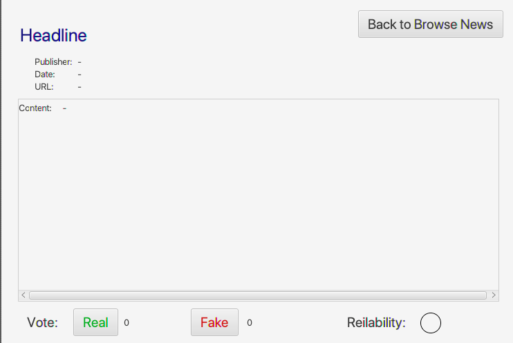

## semeter project- bilbao

this project is the group project with bilbao team member

#### what the program provides:
>* A JAVA project with Database, server, client and GUI
>* A simple way to provide news readers a reference about the news is real or fake
>* The result was a percentage collecting the voting from reader
>* There are two kind of users: admin and normal reader
>* Admin is to check the proof from reader is relative or not
>* reader is to vote a news to collect the result reference for the real or fake. When reader voting, they need to provide a proof to prove their decision

#### how the program works:
>* a client and server to connect the user interface and the database
>* using thread to deal multi-request from many users at same time
>* database to store the voting and comment from user
>we used the vote number and comment to get the rate of the truth and fake  

#### screenshot example of the program:

the add news page is to upload a news for other reader to vote.

the voting newss page is to vote if the news is true or fake.
the relability sign would be checked by the admin or automatically if the percentage is more than 80%.

